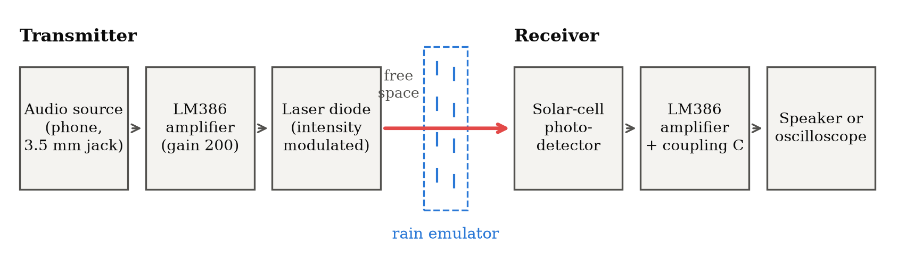
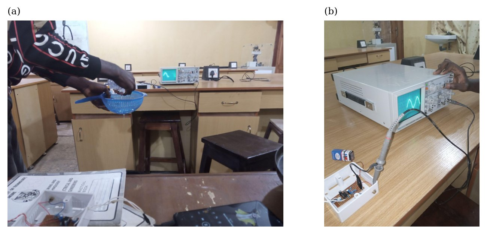
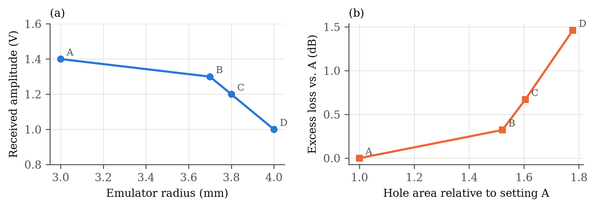
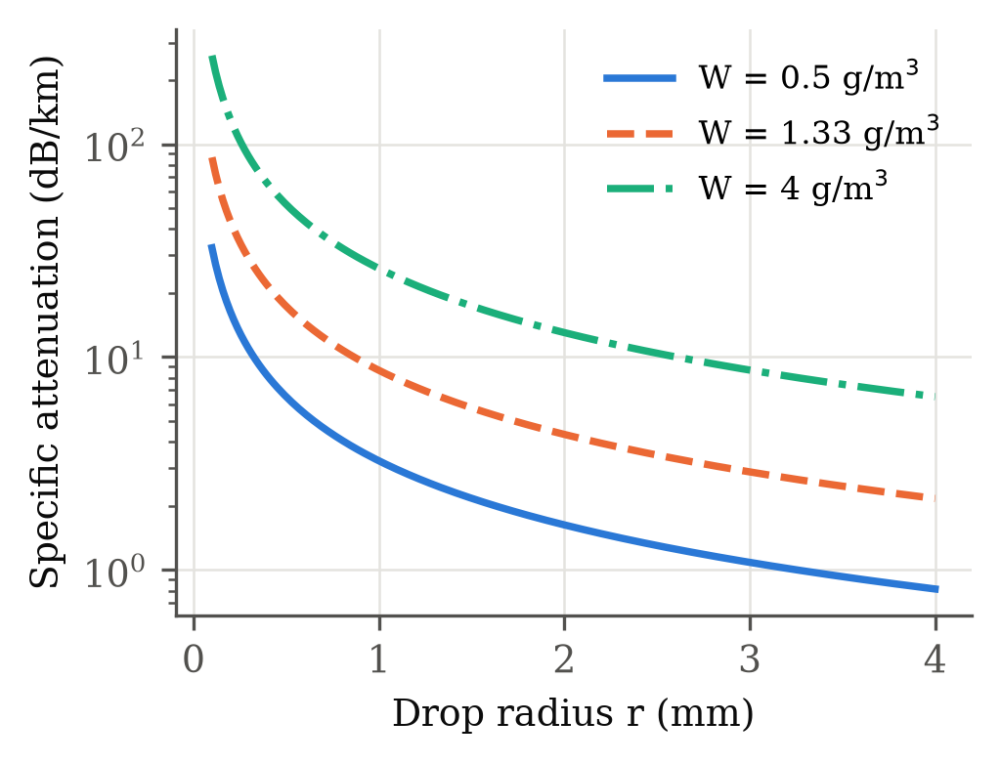
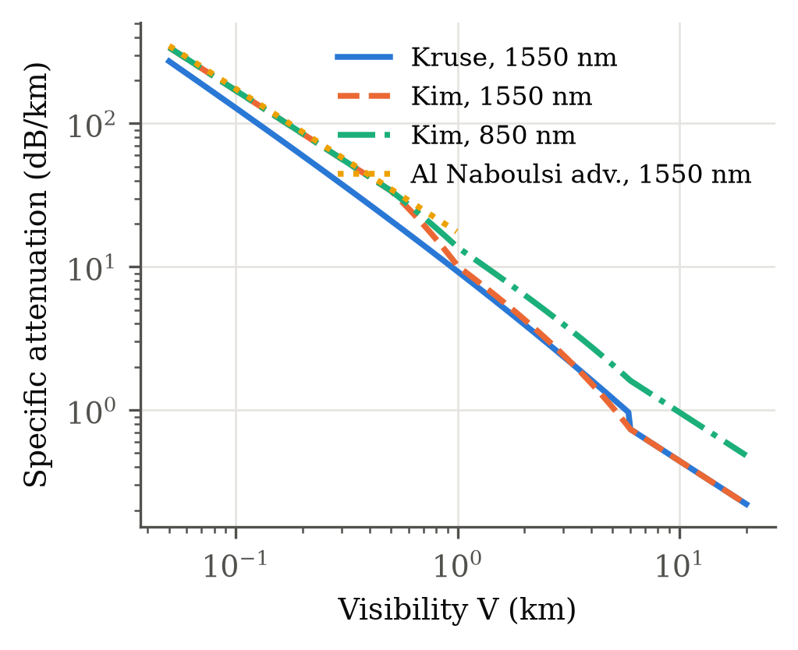
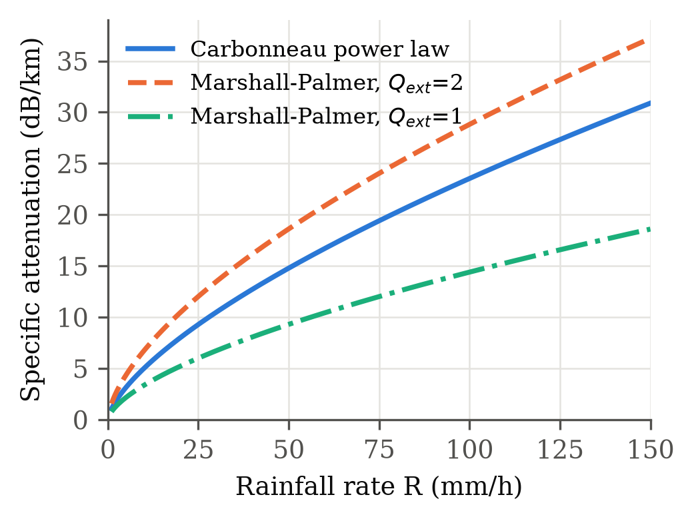
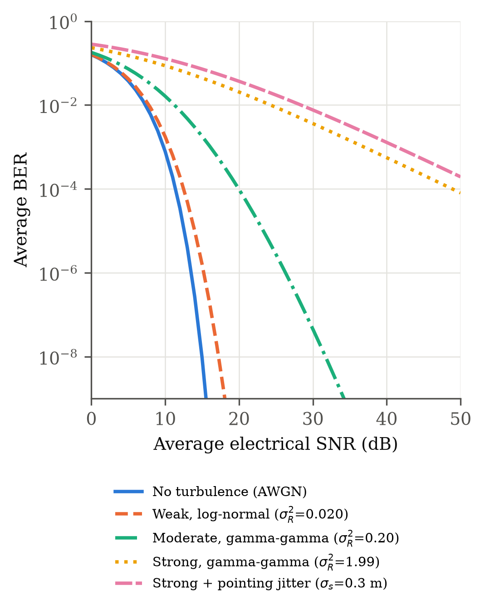
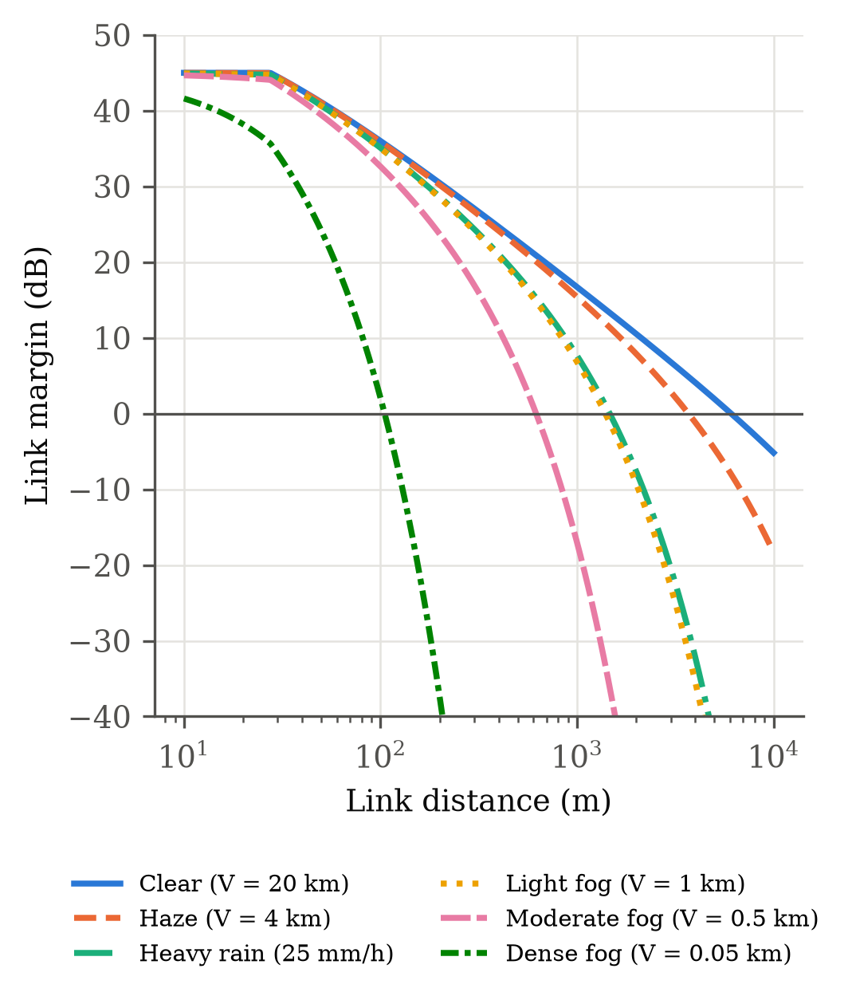

::: abstract
**Abstract.** Free-space optical (FSO) links offer licence-free, high-capacity wireless connectivity, but their availability depends strongly on local weather. This paper combines a low-cost laboratory experiment with an analytical link study. A short-range analog FSO link was built from commercial components, with an LM386-driven visible laser diode as the transmitter and a solar-cell photodetector as the receiver, and rain was emulated by releasing water through perforated emitters of 3.0 to 4.0 mm radius across the beam. The received signal fell monotonically as the emitter radius increased, with an excess loss of up to 1.46 dB relative to the smallest emitter. Geometric-optics extinction theory shows that, at a fixed liquid water content, extinction by large drops decreases as the inverse of drop radius. The measured trend is therefore attributed to the larger water throughput of the wider emitters rather than to drop size, and the emulator is shown to produce an equivalent specific attenuation of about 4,900 to 14,600 dB/km, two to three orders of magnitude above natural extreme rain. The analysis is then extended to fog, haze, rain and turbulence with the Kruse, Kim and Al Naboulsi visibility models, Marshall–Palmer and power-law rain models, and log-normal and gamma-gamma scintillation statistics with pointing error. For a representative 1550 nm link with a 2 mrad beam, the maximum range falls from 6.1 km in clear air to 1.5 km in 25 mm/h rain and to 105 m in dense fog. With one-minute rain rates measured in southern Nigeria, the same link reaches 99.99% availability against rain only up to about 680 to 900 m. The results give practical rules for designing rain emulators and for sizing FSO links in tropical climates.
:::

::: keywords
**Index Terms.** Free-space optics, atmospheric attenuation, rain emulation, fog, visibility models, gamma-gamma turbulence, link budget, optical wireless communication.
:::

# I. Introduction

Free-space optical (FSO) communication transmits information through the unguided atmosphere on an intensity-modulated optical carrier, usually in the near-infrared windows around 850 nm and 1550 nm [1], [2]. Terrestrial FSO links operate between fixed line-of-sight terminals over distances from a few tens of metres to several kilometres, and they serve as last-mile access, LAN-to-LAN bridges, fibre back-up, cellular backhaul and rapidly deployable links for disaster recovery [1], [3]. Three properties explain the interest in the technology. The optical spectrum is unlicensed, so links can be installed without a regulatory process. The beam divergence is typically on the order of a milliradian, so neighbouring links cause negligible mutual interference and interception requires physical access to the beam. Finally, the carrier frequency supports data rates in the gigabit-per-second range with compact, low-power terminals [1], [4].

These properties matter most where fibre is expensive or slow to install. Trenching, rights-of-way and the cost of civil works often dominate the cost of a fibre connection in urban areas and between buildings [5]. In many developing regions, including Nigeria, the gap between demand for broadband and the reach of wired infrastructure is wide. A short FSO link that bridges a road, a campus or a group of buildings is a practical way to extend an existing network, provided its availability under local weather is understood.

FSO also complements radio-frequency (RF) systems. Microwave and millimetre-wave links need licensed spectrum, and above roughly 10 GHz they suffer strong rain attenuation because raindrop sizes approach the carrier wavelength. Optical links behave in the opposite way. Fog and haze droplets, with radii of a few micrometres, are comparable to optical wavelengths and dominate optical extinction, while rain causes comparatively moderate optical loss. Nadeem et al. exploited this complementarity and showed that pairing an FSO link with a 40 GHz RF back-up raises the availability of the hybrid system toward carrier-class levels [6]. Any design of this kind depends on accurate weather-dependent loss estimates for the optical path. Table I summarises the main differences between the two technologies.

::: table
**TABLE I.** Comparison of terrestrial FSO and microwave or millimetre-wave RF point-to-point links [1], [2], [6]

| Attribute | FSO (850 / 1550 nm) | Microwave / mm-wave RF |
|---|---|---|
| Spectrum licence | Not required | Usually required |
| Beam divergence | About 0.5 to 5 mrad | Several degrees |
| Co-channel interference | Negligible | Must be planned |
| Interception | Requires access to the narrow beam | Possible anywhere in the main lobe |
| Dominant weather impairment | Fog and haze (Mie scattering) | Rain above about 10 GHz |
| Clear-air impairment | Scintillation, pointing error | Multipath, gaseous absorption |
| Alignment requirement | Strict (tracking often needed) | Moderate |
| Typical terrestrial range | Hundreds of metres to a few km | Up to tens of km |
:::

The atmosphere degrades an optical link through three separate mechanisms [2], [7]. The first is extinction by absorption and scattering. Molecular absorption is small inside the transmission windows, so scattering by aerosols and hydrometeors dominates. The size parameter $x = 2\pi r/\lambda$, where $r$ is the particle radius and $\lambda$ the wavelength, sets the scattering regime: Rayleigh scattering by gas molecules ($x \ll 1$), Mie scattering by fog and haze droplets ($x \approx 1$ to $100$), and geometric (non-selective) scattering by raindrops ($x \gg 1$). Dense fog is the most severe case, with specific attenuation that reaches the order of 300 dB/km at a visibility near 50 m [8]. Rain is less severe but still significant. Heavy rainfall of about 150 mm/h produces attenuation of 20 to 30 dB/km [9]. The second mechanism is atmospheric turbulence. Temperature gradients create random refractive-index fluctuations, characterised by the structure parameter $C_n^2$, which cause scintillation, beam wander and beam spreading even in clear air [10], [11]. The third mechanism is misalignment between the beam and the receiver, caused by building sway and thermal expansion, which adds random pointing loss [12]. These effects differ in time scale and statistics, so they are modelled and mitigated with different tools.

Extinction by fog and haze is predicted with visibility-based empirical models. The Kruse model relates the extinction coefficient to visibility and wavelength [13]. Kim et al. revised the wavelength exponent for low visibility on the basis of measurements at 785 nm and 1550 nm and concluded that, in dense fog, extinction becomes almost independent of wavelength [14]. Al Naboulsi et al. proposed separate relations for advection and convection fog [15], and Grabner and Kvicera derived a wavelength-dependent model from Mie theory that links the slope of the extinction curve to the effective droplet radius [16]. Rain attenuation is usually estimated with a power law in rainfall rate, fitted to measured data, or computed from a drop size distribution such as the Marshall–Palmer distribution [17], [18]. Korai et al. noted that experimental rain data at optical wavelengths remain scarce compared with the large microwave datasets collected by ITU-R, and that published optical rain studies usually cover limited local data rather than long-term statistics [8].

Experimental work falls into two groups. Field campaigns measure received power on commercial terminals while a nearby weather station records visibility or rainfall rate. Examples include rain measurements on a 700 m, 810 nm link in Kuala Lumpur [19] and a measurement setup proposed for tropical conditions in Malaysia [20]. These campaigns capture real weather but require costly equipment and long observation periods, and they cannot repeat a given condition on demand. Controlled-chamber experiments address repeatability. Ijaz et al. generated fog and smoke in an indoor chamber and measured attenuation at several wavelengths against the chamber visibility [21]. Controlled studies have focused mainly on fog and smoke, and comparatively few document rain emulation in enough detail to separate the effect of drop size from the effect of water content along the beam. Geometric-optics theory predicts that, at a fixed liquid water content, extinction by large drops scales inversely with drop radius, so an emulator that changes nozzle or hole size also changes flow rate, and the two effects are easily confounded. In addition, most chamber facilities use laboratory-grade sources and detectors, which leaves a gap for low-cost, reproducible testbeds that resource-limited laboratories can build and use to validate propagation models.

This paper addresses that gap with a low-cost analog FSO link and a simple gravity-fed rain emulator, combined with an analytical model that places the measurements in context. The objectives are: (i) to build and characterise a short-range FSO link from commercially available components, (ii) to measure the received-signal reduction produced by emulated rain at four emulator settings, (iii) to interpret the measurements with extinction theory, taking into account the liquid water content in the beam and the receiver field of view, and (iv) to extend the assessment to fog, haze, rain and turbulence through a link-budget analysis that uses established models.

The main contributions are as follows.

1. A reproducible description of a low-cost FSO testbed that uses an LM386-driven visible laser diode as the transmitter and a solar-cell photodetector with an LM386 amplifier as the receiver.
2. A rain-emulation procedure and measurement set showing that the received signal falls by up to 1.46 dB relative to the smallest emitter as the emitter radius increases from 3.0 mm to 4.0 mm.
3. A physical interpretation, based on geometric-optics extinction, showing that the observed trend follows from the larger water throughput of the wider emitters and not from drop size alone, together with a quantitative comparison of the emulator with natural rain. This identifies a confounding factor that affects simple rain emulators and yields practical design rules.
4. A unified weather-dependent link budget for 850 nm and 1550 nm links that combines the Kruse, Kim and Al Naboulsi fog and haze models, power-law and Marshall–Palmer rain models, log-normal and gamma-gamma turbulence statistics, geometric loss and pointing error, and reports link margin, bit error rate (BER) and maximum range for each weather class.

The rest of the paper is organised as follows. Section II reviews related work by theme. Section III presents the channel and link model. Section IV describes the testbed, the rain-emulation protocol and the analytical parameters. Section V presents and discusses the results. Section VI states the limitations of the study, and Section VII concludes the paper.

# II. Related Work

## A. Fog and Haze Attenuation Models

The first family of models predicts extinction from the meteorological visibility $V$, defined as the distance at which the contrast of a dark object against the horizon sky falls to 2% at 550 nm. Kruse et al. proposed a power law in wavelength whose exponent depends on visibility [13]. The model was derived for haze and is widely used for its simplicity. Kim et al. compared propagation at 785 nm and 1550 nm and found that the Kruse model overstates the advantage of long wavelengths in fog [14]. Their revised exponent falls to zero for visibility below 500 m, so that fog attenuation becomes independent of wavelength. Al Naboulsi et al. took a different route and computed extinction for advection and convection fog from droplet size distributions, which produced separate empirical fits for the two fog types over 690 to 1550 nm [15]. Grabner and Kvicera used Mie theory between 0.2 and 2 µm to show that the slope of the extinction-versus-wavelength curve is set by the effective droplet radius, and they proposed separate visibility relations for fog and haze [16].

The models agree on one point. In haze, where droplets are small, extinction decreases with wavelength and 1550 nm has a clear advantage. They disagree on how quickly that advantage vanishes as visibility falls. The Kruse model retains a 20% advantage for 1550 nm even at 50 m visibility, whereas the Kim and Al Naboulsi models predict almost no difference. Controlled measurements support the second view. Ijaz et al. found fog and smoke attenuation to be nearly independent of wavelength between 600 and 1500 nm for visibility below 500 m in a laboratory chamber [21]. The main limitation of this body of work is its reliance on visibility, a single scalar that cannot capture changes in the droplet size distribution. The models were also fitted mostly to data from temperate climates.

## B. Rain Attenuation

Rain attenuation at optical wavelengths is modelled in two ways. Empirical power laws of the form $\gamma_R = k R^{\alpha}$, with $R$ the rainfall rate in mm/h, are fitted to link measurements. The coefficients of Carbonneau and Wisely ($k = 1.076$, $\alpha = 0.67$) are among the most widely used [17]. Physical models integrate the extinction cross-section over a drop size distribution. The exponential distribution of Marshall and Palmer is the classical choice [18], and Achour simulated optical rain attenuation on this basis [22]. Korai et al. synthesised realistic rain fields and derived a prediction model for links up to 5 km that includes the effect of the drop size distribution and of multiple scattering, which reduces the predicted attenuation [8]. The two approaches agree in order of magnitude. Heavy rain of 100 to 150 mm/h produces 20 to 30 dB/km [9], far below dense fog but enough to limit kilometre-scale links.

Field measurements provide the ground truth. Mustafa et al. measured rain attenuation on a 700 m, 810 nm commercial link in Kuala Lumpur under heavy rain and drizzle and found agreement with earlier studies in other cities [19]. Zabidi et al. analysed geometric, molecular, rain, haze and scintillation losses for tropical conditions and proposed a measurement setup [20]. Nadeem et al. combined measured and modelled fog, rain and snow attenuation to select the RF frequency that best complements an FSO link [6]. Two limitations stand out. Long-term rain statistics at optical wavelengths are scarce [8], and most measured data come from temperate climates, while tropical regions such as West Africa experience rainfall rates well above those in the fitted datasets.

## C. Turbulence and Pointing Error

Clear-air turbulence produces scintillation whose strength is measured by the Rytov variance [10]. For weak turbulence the log-normal distribution describes the irradiance well, but it underestimates deep fades in stronger turbulence. Al-Habash et al. derived the gamma-gamma distribution from a doubly stochastic model in which small-scale fluctuations modulate large-scale ones, and showed that it fits simulated data from weak to strong turbulence [23]. Zhu and Kahn analysed detection and diversity techniques over turbulence channels [11]. Farid and Hranilovic added pointing error through a Gaussian-beam model with Rayleigh-distributed radial jitter and showed that the beam width can be optimised against misalignment [12]. Khalighi and Uysal reviewed these channel models together with modulation, coding and diversity techniques [1]. This body of work is mature, but it usually treats turbulence and weather attenuation separately, and it rarely addresses very short links where turbulence is negligible.

## D. Experimental Testbeds

Experimental FSO studies range from commercial field links [3], [19] to controlled atmospheric chambers [21]. Field links provide realistic conditions but cannot repeat a given event. Chambers provide repeatability, and they have been used mainly for fog, smoke and turbulence. Rain emulation receives less attention, and when nozzles or perforated emitters are used, the drop size, the flow rate and the liquid water content change together. Low-cost testbeds built from audio amplifiers and visible laser diodes are common in teaching laboratories, but they rarely report their measurements in a form that can be compared with propagation models. Table II compares representative studies with the present work.

::: table
**TABLE II.** Representative FSO weather studies published before 2022

| Ref. | Approach | Wavelength | Weather | Main outcome | Limitation |
|---|---|---|---|---|---|
| [14] | Field measurement, model fit | 785, 1550 nm | Fog, haze | Revised Kruse exponent. Fog loss nearly wavelength independent for V < 0.5 km | Visibility-only model |
| [15] | Size-distribution modelling | 690 to 1550 nm | Advection and convection fog | Separate fits by fog type | Valid for V between 50 and 1000 m |
| [16] | Mie theory | 0.2 to 2 µm | Fog, haze | Slope set by effective radius | Requires droplet statistics |
| [22] | Simulation | Near-IR | Rain | Drop size distribution-based rain loss | No measurement |
| [8] | Simulated rain fields | Near-IR | Rain | Prediction model up to 5 km, multiple scattering | Relies on synthetic rain maps |
| [19] | Commercial field link, 700 m | 810 nm | Tropical rain | Agreement with other cities | Short campaign |
| [20] | Analysis, proposed setup | Near-IR | Tropical weather | Link availability analysis | No measured data reported |
| [6] | Measurement and modelling | Near-IR and 40 GHz | Fog, rain, snow | Hybrid FSO/RF for high availability | Temperate climate |
| [21] | Indoor chamber | 600 to 1500 nm | Fog, smoke | Wavelength independence at low visibility | No rain |
| This work | Low-cost testbed with rain emulator, link model | Visible (testbed), 850 and 1550 nm (model) | Emulated rain, modelled fog, haze, rain, turbulence | Water throughput governs emulator loss. Weather-dependent range | Single-shot readings, short path |
:::

## E. Research Gap

Three gaps follow from this review. First, rain emulators are rarely characterised in terms of liquid water content, so their results cannot be compared with natural rain. Second, low-cost testbeds seldom report their measurements in terms that link them to propagation theory. Third, few studies present fog, rain and turbulence effects on a common link budget for the same terminal parameters. The present work addresses the first two gaps experimentally and the third analytically.

# III. Channel and Link Model

## A. Beer–Lambert Law and Extinction

The mean optical power received after propagation over a distance $L$ through a homogeneous medium follows the Beer–Lambert law [2], [7]:

$$P_R(L) = P_R(0)\,\exp\!\left(-\beta L\right), \qquad (1)$$

where $P_R(0)$ is the power that would be received without extinction and $\beta$ (m⁻¹) is the extinction coefficient. The coefficient is the sum of absorption and scattering by molecules and aerosols, $\beta = \alpha_m + \alpha_a + \beta_m + \beta_a$. Inside the 850 nm and 1550 nm windows molecular absorption is small, and aerosol and hydrometeor scattering dominate. The attenuation in decibels is

$$A = 10\log_{10}\frac{P_R(0)}{P_R(L)} = 4.343\,\beta L, \qquad (2)$$

and the specific attenuation $\gamma = 4.343\,\beta$ is expressed in dB/km when $\beta$ is in km⁻¹.

For a population of spherical particles with number density $n(r)$ per unit radius, the extinction coefficient is

$$\beta = \int_0^{\infty} Q_{ext}(x, m)\,\pi r^2\, n(r)\,dr, \qquad (3)$$

where $Q_{ext}$ is the Mie extinction efficiency, a function of the size parameter $x = 2\pi r/\lambda$ and the complex refractive index $m$ of the particle. For $x \ll 1$ (molecules) the efficiency scales as $\lambda^{-4}$, which is Rayleigh scattering. For $x$ near unity (fog and haze) it oscillates and depends strongly on wavelength. For $x \gg 1$ (raindrops, with $x$ of order $10^4$ at 1550 nm) it tends to 2, the so-called extinction paradox [7], [10]. Half of this extinction is geometric blocking and refraction, and the other half is diffraction into a narrow forward lobe. A receiver with a narrow field of view (FOV) sees the full value $Q_{ext} = 2$. A receiver with a wide FOV placed close to the scatterers recaptures much of the diffracted light, and its effective efficiency approaches 1. This distinction is important for the interpretation of the experiment in Section V.

## B. Fog and Haze: Visibility Models

The Kruse model [13] expresses the extinction coefficient in km⁻¹ as

$$\beta_{fog} = \frac{3.91}{V}\left(\frac{\lambda}{550\ \mathrm{nm}}\right)^{-q}, \qquad (4)$$

where $V$ is the visibility in km and $q$ is a size-distribution exponent:

$$q_{Kruse} = \begin{cases} 1.6, & V > 50\ \mathrm{km} \\ 1.3, & 6 < V \le 50\ \mathrm{km} \\ 0.585\,V^{1/3}, & V \le 6\ \mathrm{km}. \end{cases} \qquad (5)$$

The constant 3.91 equals $-\ln 0.02$ and follows from the 2% contrast definition of visibility. Kim et al. replaced the low-visibility branch with [14]

$$q_{Kim} = \begin{cases} 1.6, & V > 50\ \mathrm{km} \\ 1.3, & 6 < V \le 50\ \mathrm{km} \\ 0.16\,V + 0.34, & 1 < V \le 6\ \mathrm{km} \\ V - 0.5, & 0.5 < V \le 1\ \mathrm{km} \\ 0, & V \le 0.5\ \mathrm{km}. \end{cases} \qquad (6)$$

Physically, $q = 0$ means that fog droplets are large enough for $Q_{ext}$ to have reached its asymptotic value at all wavelengths of interest, so the choice of wavelength no longer matters. Al Naboulsi et al. [15] gave, for $\lambda$ in µm and $V$ in km,

$$\beta_{adv} = \frac{0.11478\,\lambda + 3.8367}{V}, \qquad \beta_{conv} = \frac{0.18126\,\lambda^2 + 0.13709\,\lambda + 3.7502}{V}, \qquad (7)$$

for advection and convection fog respectively, valid for 690 nm to 1550 nm and visibility between 50 m and 1 km.

## C. Rain

The empirical power law of Carbonneau and Wisely [17] is

$$\gamma_R = 1.076\,R^{0.67}\quad \mathrm{dB/km}, \qquad (8)$$

with $R$ in mm/h. Because raindrops are in the geometric regime, the loss is independent of wavelength across the optical band. A physical estimate follows from (3) with the Marshall–Palmer distribution [18],

$$N(D) = N_0\,e^{-\Lambda D}, \qquad N_0 = 8000\ \mathrm{m^{-3}\,mm^{-1}}, \qquad \Lambda = 4.1\,R^{-0.21}\ \mathrm{mm^{-1}}, \qquad (9)$$

where $D = 2r$ is the drop diameter in mm. With a constant efficiency $Q_{ext}$, the integral has a closed form:

$$\beta_R = Q_{ext}\int_0^{\infty}\frac{\pi D^2}{4}N_0 e^{-\Lambda D}\,dD = \frac{\pi Q_{ext} N_0}{2\Lambda^3}. \qquad (10)$$

The liquid water content (LWC) of the same distribution is

$$W = \rho_w\int_0^{\infty}\frac{\pi D^3}{6}N_0 e^{-\Lambda D}\,dD = \frac{\pi\rho_w N_0}{\Lambda^4}, \qquad (11)$$

with $\rho_w = 1000$ kg/m³. Eq. (10) with $Q_{ext} = 2$ gives an upper bound (narrow FOV), and $Q_{ext} = 1$ a lower bound (full recapture of diffraction).

A result that is central to this paper follows from (3) for drops of a single radius $r$. The number density that corresponds to a given LWC $W$ is $n = 3W/(4\pi r^3 \rho_w)$, so that

$$\beta = Q_{ext}\,\pi r^2\, n = \frac{3\,Q_{ext}\,W}{4\,\rho_w\,r}. \qquad (12)$$

At a fixed amount of water per unit volume, extinction decreases as $1/r$. Large drops put the same mass of water into fewer, bigger scatterers with a smaller total cross-section. Any experiment in which larger drops produce larger loss must therefore also have supplied more water to the beam.

## D. Geometric Loss and Link Budget

A transmitter of aperture diameter $D_T$ and full divergence angle $\theta$ produces at distance $L$ a spot of diameter approximately $D_T + \theta L$. For a receiver of diameter $D_R$ smaller than the spot, the geometric loss is [7], [20]

$$L_{geo} = 20\log_{10}\frac{D_T + \theta L}{D_R}\quad \mathrm{dB}, \qquad (13)$$

and $L_{geo} = 0$ when the receiver collects the whole beam. This linear growth of the spot, not the inverse-square law, governs the loss of a collimated beam at the ranges of interest. The link margin is

$$M(L) = P_T - L_{opt} - L_{geo}(L) - \gamma L - S_R, \qquad (14)$$

where $P_T$ is the transmitted power in dBm, $L_{opt}$ the combined optical losses of the terminals, $\gamma$ the specific attenuation of the prevailing weather and $S_R$ the receiver sensitivity in dBm. The maximum range for a given weather class is the distance at which $M(L) = 0$.

## E. Turbulence

The strength of scintillation for a plane wave is characterised by the Rytov variance [10]

$$\sigma_R^2 = 1.23\,C_n^2\,k^{7/6}L^{11/6}, \qquad (15)$$

where $k = 2\pi/\lambda$ is the wavenumber and $C_n^2$ (m−2/3) the refractive-index structure parameter. Typical values near the ground range from about $10^{-15}$ (weak) to $10^{-13}$ m−2/3 (strong) [7], [10]. For weak turbulence ($\sigma_R^2 < 1$) the normalised irradiance $h_a$, with $E[h_a] = 1$, is modelled as log-normal:

$$f_{LN}(h_a) = \frac{1}{h_a\sqrt{2\pi\sigma_R^2}}\exp\!\left[-\frac{\left(\ln h_a + \sigma_R^2/2\right)^2}{2\sigma_R^2}\right]. \qquad (16)$$

For moderate to strong turbulence the gamma-gamma distribution is used [23]:

$$f_{GG}(h_a) = \frac{2(\alpha\beta)^{(\alpha+\beta)/2}}{\Gamma(\alpha)\Gamma(\beta)}\,h_a^{\frac{\alpha+\beta}{2}-1}\,K_{\alpha-\beta}\!\left(2\sqrt{\alpha\beta h_a}\right), \qquad (17)$$

where $K_\nu(\cdot)$ is the modified Bessel function of the second kind and, for a plane wave with negligible inner scale,

$$\alpha = \left[\exp\!\left(\frac{0.49\,\sigma_R^2}{\left(1+1.11\,\sigma_R^{12/5}\right)^{7/6}}\right)-1\right]^{-1}, \quad \beta = \left[\exp\!\left(\frac{0.51\,\sigma_R^2}{\left(1+0.69\,\sigma_R^{12/5}\right)^{5/6}}\right)-1\right]^{-1}. \qquad (18)$$

The parameters $\alpha$ and $\beta$ are the effective numbers of large-scale and small-scale scattering cells, and the scintillation index is $\sigma_I^2 = 1/\alpha + 1/\beta + 1/(\alpha\beta)$.

## F. Pointing Error

Following Farid and Hranilovic [12], a Gaussian beam of radius $w_z$ at the receiver, falling on a circular aperture of radius $a$ with radial displacement $r$, delivers the fraction

$$h_p(r) \approx A_0\exp\!\left(-\frac{2r^2}{w_{z,eq}^2}\right), \qquad A_0 = \left[\mathrm{erf}(v)\right]^2, \qquad v = \frac{\sqrt{\pi}\,a}{\sqrt{2}\,w_z}, \qquad (19)$$

with $w_{z,eq}^2 = w_z^2\sqrt{\pi}\,\mathrm{erf}(v)/\left[2v\exp(-v^2)\right]$. The displacement is Rayleigh distributed with jitter standard deviation $\sigma_s$. The constant $A_0$ is already contained in the geometric loss (13), so only the normalised fluctuation $h_p/A_0$ enters the error analysis.

## G. SNR and BER for Intensity Modulation with Direct Detection

For on-off keying (OOK) with intensity modulation and direct detection (IM/DD) and signal-independent Gaussian noise, the conditional bit error probability is

$$P_e(h) = Q\!\left(\sqrt{\bar{\gamma}}\,h\right), \qquad (20)$$

where $Q(\cdot)$ is the Gaussian Q-function, $h = h_a h_p/A_0$ the normalised channel state and $\bar{\gamma} = (\Re \bar{P}_R)^2/\sigma_n^2$ the average electrical signal-to-noise ratio (SNR), with $\Re$ the responsivity, $\bar{P}_R$ the mean received power (which includes the weather attenuation of Section III-A to C) and $\sigma_n^2$ the noise variance [1], [11]. The average BER is

$$\bar{P}_e = \int_0^{\infty}\!\!\int_0^{\infty} Q\!\left(\sqrt{\bar{\gamma}}\,h_a\,\frac{h_p(r)}{A_0}\right) f(h_a)\,f_R(r)\,dh_a\,dr, \qquad (21)$$

where $f_R(r)$ is the Rayleigh density. Weather attenuation therefore acts on $\bar{\gamma}$ through the mean received power, while turbulence and pointing error act on the distribution of $h$. This separation reflects the different time scales of the impairments. Fog and rain change over minutes, whereas scintillation fluctuates within milliseconds.

# IV. Experimental Testbed and Methods

## A. Transmitter

Fig. 1 shows the block diagram of the testbed. The audio signal from a mobile phone enters the transmitter through a 3.5 mm jack and a 10 kΩ potentiometer (VR1) that sets the drive level at the non-inverting input (pin 3) of an LM386 low-voltage audio power amplifier. The amplifier runs from a 9 V battery, decoupled by a 100 µF capacitor. A 10 µF capacitor in series with a 220 Ω trimmer (VR2) between pins 1 and 8 sets the voltage gain, which reaches its maximum of 200 with the trimmer at zero, and a 10 µF capacitor on pin 7 bypasses the internal bias. A 0.047 µF capacitor in series with 10 Ω across the output suppresses high-frequency oscillation. The output (pin 5) drives the laser diode through two 56 Ω resistors and a 100 Ω trimmer (VR3), which together set the bias current and limit the peak current. The optical output therefore follows the audio waveform around a DC operating point, which is analog intensity modulation of the optical carrier. The source is a low-power visible laser diode of the laser-pointer class. Its wavelength and output power were not measured. The analysis in Section IV-E assumes a red emitter at 650 nm with 5 mW output, typical of this class. Table III lists the components.

::: table
**TABLE III.** Testbed components and parameters

| Block | Component | Value or setting |
|---|---|---|
| Source | Mobile phone, .mp3 audio | 3.5 mm jack |
| Transmitter amplifier | LM386 | Gain 200 (10 µF, pins 1 to 8), 9 V supply |
| Optical source | Visible laser diode, laser-pointer class | Driven through 2 × 56 Ω and 100 Ω trimmer (VR3) |
| Photodetector | Calculator-type solar panel | 10 kΩ level preset (VR4), 10 µF coupling (C5) |
| Receiver amplifier | LM386, 220 µF output coupling to 8 Ω, 0.5 W speaker | 9 V supply |
| Output | Loudspeaker, analog oscilloscope (40 MHz) | Amplitude read from graticule |
| Link distance | Indoor laboratory benches | About 3 to 4 m in rain tests (estimated from photographs). Working range 10 to 20 m |
:::

## B. Receiver

A calculator-type solar panel serves as a large-area photodetector. A 10 kΩ preset (VR4) across the panel sets the signal level, and a 10 µF capacitor couples it to pin 3 of the receiver LM386. Its photocurrent is proportional to the incident optical power, and a coupling capacitor removes the DC component produced by ambient light and by the mean laser power. The AC component is amplified by the second LM386 and drives an 8 Ω, 0.5 W loudspeaker through a 220 µF capacitor. The oscilloscope probe is connected at the amplifier output. A solar cell has a large junction capacitance and therefore a bandwidth of a few tens of kilohertz at most, which is adequate for audio but excludes digital data at useful rates. Its large area, however, gives the receiver a wide FOV, which becomes relevant to the rain measurements.

## C. Rain Emulator and Measurement Procedure

Rain was emulated by releasing water from a hand-held container through a perforated plastic emitter held above the beam, so that the water crossed the optical path close to the midpoint of the link (Fig. 2(a)). Four emitters, labelled A to D, were characterised by radii of 3.0, 3.7, 3.8 and 4.0 mm, intended to represent increasing drop size. Drops released from a perforation grow with the perforation radius, and the flow through a perforation grows with its area, so the radius serves here as the control variable of the emitter. The analysis in Section V-B treats it as the perforation radius and shows that the conclusions hold if it is read as the drop radius. For each emitter the following procedure was applied.

1. The link was aligned in dry conditions and the received waveform was recorded on the oscilloscope (Fig. 2(b)).
2. Water was released through the emitter across the beam while the waveform was observed.
3. The amplitude of the received waveform was read from the oscilloscope graticule.

The transmitter output amplitude was 2.0 V throughout. The water was poured by hand from a plastic bottle, so the volume and duration of each pour were not metered. The dry-channel received amplitude was observed but not recorded as a number, and each condition was measured once. The falling water crossed a length of beam comparable to the emitter diameter, estimated from Fig. 2(a) at 0.1 to 0.3 m.

## D. Data Processing

The receiver chain is assumed to operate in its linear range, which is consistent with the undistorted sinusoidal traces observed on the oscilloscope. The oscilloscope amplitude $V$ is then proportional to the photocurrent and hence to the received optical power. The excess optical loss of emitter $j$ relative to a reference reading $V_{ref}$ is

$$\Delta A_j = 10\log_{10}\frac{V_{ref}}{V_j}\quad \mathrm{dB}. \qquad (22)$$

A factor of 10, not 20, applies because the voltage is proportional to optical power, not to optical field. Because the dry-channel amplitude was not recorded as a number, emitter A serves as the reference. The results therefore describe the additional loss caused by the wider emitters.

## E. Analytical Study

The analytical study evaluates the models of Section III for two classes of link. The first is the testbed itself, used to check which impairments matter at 10 to 20 m. The second is a representative terrestrial link at 850 nm and 1550 nm with parameters typical of commercial terminals [1], [3]. Table IV lists the parameters. Values marked as assumed are nominal and are stated so that the calculation can be reproduced and updated.

::: table
**TABLE IV.** Parameters of the analytical study

| Parameter | Testbed | Representative link |
|---|---|---|
| Wavelength | 650 nm (assumed) | 850 nm, 1550 nm |
| Transmitted power $P_T$ | 7 dBm (5 mW, assumed) | 13 dBm (20 mW) |
| Full divergence $\theta$ | 1 mrad (assumed) | 2 mrad |
| Transmit aperture $D_T$ | 3 mm | 2.5 cm |
| Receive aperture $D_R$ | 3 cm (equivalent, assumed) | 8 cm |
| Terminal optical loss $L_{opt}$ | 1 dB | 3 dB |
| Receiver sensitivity $S_R$ | Not applicable (analog) | −35 dBm |
| Structure parameter $C_n^2$ | $10^{-13}$ m−2/3 (worst case) | $10^{-15}$, $10^{-14}$, $10^{-13}$ m−2/3 |
| Pointing jitter $\sigma_s$ | Not applicable | 0.3 m at 1 km |
| Receiver radius $a$ | Not applicable | 4 cm |
:::

Visibility classes follow the international visibility code used by Kim et al. [14], and rain classes span 2.5 to 100 mm/h. The integrals in (21) were evaluated numerically in Python with NumPy and SciPy, using a logarithmic grid of 6,000 points for $h_a$ between $10^{-5}$ and 31.6 and 400 equiprobable quantiles of the Rayleigh distribution for $r$. The script that produces every number and figure in Section V is provided as supplementary material.

# V. Results and Discussion

## A. Measured Effect of the Rain Emulator

Table V and Fig. 3 present the measurements. The received amplitude fell from 1.4 V with emitter A to 1.0 V with emitter D. By (22), this corresponds to excess losses of 0.32, 0.67 and 1.46 dB for emitters B, C and D. The trend is monotonic, but it is not smooth. The step from C to D (0.79 dB for a 0.2 mm change in radius) is larger than the step from A to B (0.32 dB for a 0.7 mm change). Because each condition was measured once, a reading uncertainty of about ±0.05 V, typical of reading an analog graticule, corresponds to roughly ±0.2 dB, so the difference between B and C lies at the edge of what the data can resolve.

::: table
**TABLE V.** Measured received amplitude and excess loss

| Emitter | Radius (mm) | Hole area relative to A | Received amplitude (V) | Excess loss vs. A (dB) |
|---|---|---|---|---|
| A | 3.0 | 1.00 | 1.4 | 0.00 |
| B | 3.7 | 1.52 | 1.3 | 0.32 |
| C | 3.8 | 1.60 | 1.2 | 0.67 |
| D | 4.0 | 1.78 | 1.0 | 1.46 |
:::

The audio output remained intelligible under all four conditions, and the listener noted a loss of crispness compared with the source. That degradation is consistent with the combined effect of the limited bandwidth of the solar cell, the nonlinearity of the laser-diode characteristic under analog drive and electrical pickup in the laboratory. It is not attributable to the emulated rain alone.

## B. Physical Interpretation: Water Throughput, Not Drop Size

The original interpretation of these data was that larger drops cause larger attenuation. Eq. (12) shows that this reading cannot be correct on its own. Fig. 4 plots (12) for three values of LWC. At any fixed LWC, the specific attenuation of 4 mm drops is one quarter of that of 1 mm drops. If emitters A to D had delivered the same water content with progressively larger drops, the received signal would have increased, not decreased.

The observed behaviour follows once the emitter is viewed as a flow device. The perforation area grows by 78% from A to D (Table V), and the volume flow through a gravity-fed perforation grows at least in proportion to its area. More water per second crossing the beam means more drops, and more drops mean a larger total cross-section. The photograph in Fig. 2(a) also shows that the wider perforations produced continuous streams over part of their fall, and a stream blocks a larger fraction of the beam than the same volume broken into drops. Both effects increase with emitter size and outweigh the $1/r$ decrease predicted by (12). The measured trend is therefore a throughput effect. This result matters beyond the present setup. Any emulator in which the nozzle or hole size is the control variable changes drop size and water content together, and its results cannot be expressed as a function of rainfall rate unless the flow rate is measured.

The magnitude of the emulator loss can be placed on the scale of natural rain. The falling water occupied only a short length $\ell$ of the beam, estimated from Fig. 2(a) at 0.1 to 0.3 m. The 1.46 dB excess loss of emitter D over that length corresponds to an equivalent specific attenuation of 14,600 dB/km for $\ell = 0.1$ m, 7,300 dB/km for $\ell = 0.2$ m and 4,900 dB/km for $\ell = 0.3$ m. This is two to three orders of magnitude above the 23.5 dB/km predicted by (8) for extreme rain of 100 mm/h, and more than ten times the attenuation of dense fog. Solving (12) for the water content with $r = 2$ mm gives $W$ between 1.5 and 4.5 kg/m³ for $Q_{ext} = 2$, and twice as much for $Q_{ext} = 1$. Marshall–Palmer rain at 100 mm/h contains 4.3 g/m³ by (11). The emulator thus behaves as a dense water curtain, with roughly 350 to 2,100 times the water content of extreme natural rain, concentrated in a short section of the path. Because the reference is emitter A rather than the dry channel, these figures are lower bounds on the total emulator loss.

The receiver FOV reduces the measured loss further. With a large solar cell placed a few metres beyond the curtain, much of the light diffracted by the drops into the forward lobe still reaches the detector. The effective efficiency then lies between 1 and 2, and the measured loss understates the true extinction by up to a factor of two. A narrow-FOV receiver, such as a photodiode behind a lens and a small field stop, would measure extinction closer to the textbook value.

These considerations lead to four design rules for low-cost rain emulators. First, control and record the volume flow rate and the wetted length of the path, from which the LWC and an equivalent rainfall rate follow. Second, vary the drop size and the flow rate independently, for example by changing the number of perforations at a fixed perforation size. Third, record a dry-channel reference before and after each wet measurement. Fourth, specify the receiver FOV, or use a narrow-FOV receiver when the aim is to compare with extinction models.

## C. Relevance of Weather to the Testbed Itself

At 10 m the beam of the testbed grows to about 13 mm and at 20 m to about 23 mm (Table IV), both smaller than the receiving panel (about 3 cm equivalent diameter). The geometric loss is therefore zero and the testbed captures the whole beam. Natural weather would have little effect over such a path. Dense fog with 340 dB/km would cause 3.4 dB over 10 m, and rain of 100 mm/h would cause only 0.24 dB. The Rytov variance at 650 nm over 10 m is 0.0012 even with $C_n^2 = 10^{-13}$ m−2/3, so scintillation is negligible. The 1.46 dB produced by the emulator over a fraction of a metre exceeds the effect of extreme natural rain over the full 10 m link by a factor of about six. Short demonstration links therefore need a concentrated impairment to show any effect, and that impairment must be quantified before the results are compared with natural weather. This is the practical reason for the design rules above.

## D. Fog and Haze

Fig. 5 compares the visibility models, and Table VI lists the specific attenuation and the resulting maximum range for each visibility class. In clear air (V = 20 km) the specific attenuation is 0.48 dB/km at 850 nm and 0.22 dB/km at 1550 nm, and extinction is negligible compared with the 28 dB geometric loss of the representative link at 1 km. As visibility falls, attenuation rises roughly in inverse proportion. In light fog (V = 1 km) the Kim model gives 13.7 dB/km at 850 nm and 10.1 dB/km at 1550 nm, and the maximum range is 1.15 km and 1.39 km respectively. In moderate and denser fog the Kim model predicts no difference between wavelengths, with 34 dB/km at V = 0.5 km and 340 dB/km at V = 50 m. The range then collapses to 619 m and 105 m.

::: table
**TABLE VI.** Fog and haze attenuation (Kim model unless stated) and maximum range of the representative link

| Visibility class | V (km) | γ at 650 nm (dB/km) | γ at 850 nm (dB/km) | γ at 1550 nm (dB/km) | Kruse, 1550 nm (dB/km) | Al Naboulsi adv., 1550 nm (dB/km) | Range 850 nm (m) | Range 1550 nm (m) |
|---|---|---|---|---|---|---|---|---|
| Dense fog | 0.05 | 339.6 | 339.6 | 339.6 | 271.7 | 348.7 | 105 | 105 |
| Thick fog | 0.2 | 84.9 | 84.9 | 84.9 | 59.6 | 87.2 | 315 | 315 |
| Moderate fog | 0.5 | 34.0 | 34.0 | 34.0 | 21.0 | 34.9 | 619 | 619 |
| Light fog | 1 | 15.6 | 13.7 | 10.1 | 9.3 | 17.4 | 1,151 | 1,393 |
| Thin fog | 2 | 7.60 | 6.37 | 4.29 | 3.96 | Not valid | 1,837 | 2,288 |
| Haze | 4 | 3.60 | 2.77 | 1.54 | 1.62 | Not valid | 2,852 | 3,689 |
| Light haze | 10 | 1.37 | 0.96 | 0.44 | 0.44 | Not valid | 4,368 | 5,395 |
| Clear | 20 | 0.68 | 0.48 | 0.22 | 0.22 | Not valid | 5,291 | 6,082 |
| Very clear | 50 | 0.27 | 0.19 | 0.09 | 0.09 | Not valid | 6,188 | 6,636 |
:::

The models agree in haze and diverge in fog. At V = 50 m the Kruse model predicts 272 dB/km at 1550 nm, 20% below the Kim value, while the Al Naboulsi advection model predicts 349 dB/km, within 3% of Kim. For a 300 m link, the difference between the Kruse and Kim predictions at V = 0.2 km amounts to 7.6 dB, enough to change a design decision. The chamber results of Ijaz et al. [21] and the measurements of Kim et al. [14] both support wavelength independence at low visibility. The practical conclusion is that 1550 nm offers a real advantage in haze and thin fog, where it extends the range by 20 to 30%, but no advantage in moderate or dense fog. The choice of 1550 nm should therefore rest on eye safety, which permits higher transmit power, and on the availability of amplifiers and detectors, rather than on fog performance.

## E. Rain

Fig. 6 compares the rain models and Table VII lists the results. The Carbonneau power law lies between the Marshall–Palmer bounds for $Q_{ext} = 2$ and $Q_{ext} = 1$ over the whole range of rainfall rates. At 25 mm/h it gives 9.3 dB/km, compared with 12.0 dB/km and 6.0 dB/km for the two bounds. This position is consistent with the argument of Section V-B. Measured links, from whose data the power law was fitted, recapture part of the forward-diffracted light, so their apparent extinction falls between the narrow-FOV and wide-FOV limits. It also agrees with the observation of Korai et al. that multiple scattering reduces the attenuation relative to single-scattering predictions [8].

::: table
**TABLE VII.** Rain attenuation and maximum range of the representative link (wavelength independent)

| Rain class | R (mm/h) | Carbonneau (dB/km) | M–P, $Q_{ext}=2$ (dB/km) | M–P, $Q_{ext}=1$ (dB/km) | LWC (g/m³) | Range (m) |
|---|---|---|---|---|---|---|
| Light | 2.5 | 1.99 | 2.82 | 1.41 | 0.19 | 3,317 |
| Moderate | 12.5 | 5.84 | 7.78 | 3.89 | 0.74 | 1,929 |
| Heavy | 25 | 9.30 | 12.03 | 6.02 | 1.33 | 1,467 |
| Very heavy | 50 | 14.80 | 18.62 | 9.31 | 2.38 | 1,093 |
| Extreme | 100 | 23.54 | 28.82 | 14.41 | 4.26 | 800 |
:::

Rain limits range less severely than fog. Heavy rain of 25 mm/h causes about the same loss as light fog at 1 km visibility and reduces the range of the representative link to 1.47 km. Extreme rain of 100 mm/h reduces it to 800 m, still eight times the dense-fog range. The value of 23.5 dB/km at 100 mm/h agrees with the 20 to 30 dB/km reported for rates of 100 to 150 mm/h [9]. These results matter for tropical deployments. Nigeria illustrates the point. One-minute rainfall rates exceeded for 0.01% of an average year (about 53 minutes) range from 77 to 110 mm/h in the South-West region and from 111 to 125 mm/h in the South-East, according to rain rates derived from TRMM satellite data for 37 stations [24]. Rain-gauge measurements at Ota in the South-West gave 141 mm/h at 0.01%, well above the ITU-R prediction for the site [25], and rain-rate maps built from 30 years of Nigerian data show the same north-south gradient [26]. With (8), these rates give 19.8 to 29.6 dB/km. For 99.99% availability against rain, the representative link is limited to 900 m at 77 mm/h, 770 m at 110 mm/h and 680 m at 141 mm/h. A 500 m link keeps 8 to 13 dB of margin in the same storms, whereas a 1 km link falls 3 to 13 dB short. Because rain affects 850 nm and 1550 nm equally, wavelength selection offers no protection against it, and a hybrid RF back-up at a frequency below about 10 GHz is the effective remedy [6].

## F. Turbulence and Pointing Error

Table VIII lists the turbulence parameters for a 1 km path. For the same $C_n^2$, the Rytov variance at 1550 nm is half that at 850 nm, because $\sigma_R^2$ scales as $\lambda^{-7/6}$. Under strong turbulence ($C_n^2 = 10^{-13}$ m−2/3) the scintillation index reaches 1.17 at 850 nm and 0.98 at 1550 nm.

::: table
**TABLE VIII.** Turbulence parameters for a 1 km path

| Regime | $C_n^2$ (m−2/3) | λ (nm) | $\sigma_R^2$ | α | β | Scintillation index |
|---|---|---|---|---|---|---|
| Weak | $10^{-15}$ | 850 | 0.040 | 51.7 | 49.0 | 0.040 |
| Weak | $10^{-15}$ | 1550 | 0.020 | 103.2 | 98.5 | 0.020 |
| Moderate | $10^{-14}$ | 850 | 0.401 | 6.86 | 5.32 | 0.361 |
| Moderate | $10^{-14}$ | 1550 | 0.199 | 11.70 | 10.17 | 0.192 |
| Strong | $10^{-13}$ | 850 | 4.013 | 4.34 | 1.31 | 1.171 |
| Strong | $10^{-13}$ | 1550 | 1.991 | 3.99 | 1.71 | 0.984 |
:::

Fig. 7 shows the average BER of OOK at 1550 nm over 1 km. Without turbulence, a BER of $10^{-6}$ requires an average electrical SNR of 13.5 dB. Weak turbulence raises the requirement to 15.2 dB, and moderate turbulence to 26.3 dB, a penalty of about 13 dB. Under strong turbulence the BER does not reach $10^{-6}$ even at 50 dB, and a BER of $10^{-3}$, a common threshold for forward error correction, requires 36.9 dB. Pointing jitter of 0.3 m with a 1 m beam radius adds a further 4.4 dB at that BER. These penalties are of the same order as the weather attenuation of a few hundred metres of moderate fog, which shows that clear-air turbulence can limit a link as severely as weather. They also explain why aperture averaging, spatial diversity and coding are standard mitigation tools [1], [11].

## G. Link Budget and Maximum Range

Fig. 8 shows the link margin of the representative 1550 nm link for six weather conditions. At short range the margin is limited by the terminal losses and receiver sensitivity only. Beyond about 27 m the spot exceeds the receiver aperture, and the geometric loss grows by 20 dB per decade of distance. In clear air and haze, geometric loss dominates and the range reaches 6.1 km and 3.7 km. In heavy rain and light fog, weather attenuation dominates beyond a few hundred metres, and the range falls to about 1.4 to 1.5 km. In dense fog the range is 105 m.

Three engineering trade-offs follow. First, beam divergence trades geometric loss against pointing tolerance. Halving $\theta$ from 2 to 1 mrad would reduce geometric loss by 6 dB at long range but would make the link more sensitive to building sway and would call for active tracking [12]. Second, the receiver aperture reduces geometric loss and, through aperture averaging, scintillation, but it increases terminal size and cost and collects more background light. Third, the choice between 850 nm and 1550 nm matters in haze and light fog and in turbulence, where 1550 nm performs better, but not in rain or dense fog. For a campus-scale link in a tropical city, where dense fog is rare but heavy convective rain is frequent, the Nigerian rain rates of Section V-E indicate that links of up to about 700 to 900 m can reach 99.99% availability against rain with the representative terminal. Longer links require more transmit power, a larger receiver or an RF back-up.

## H. Comparison With Previous Studies

The present results are consistent with earlier work in four respects. The wavelength independence of fog attenuation at low visibility agrees with the measurements of Kim et al. [14] and the chamber results of Ijaz et al. [21]. The magnitude of rain attenuation agrees with the 20 to 30 dB/km reported for heavy rain [9] and with the order of magnitude of the tropical measurements of Mustafa et al. [19]. The complementary behaviour of fog and rain supports the hybrid architecture proposed by Nadeem et al. [6]. The turbulence penalties follow the behaviour established by Al-Habash et al. [23] and Zhu and Kahn [11]. The new element is the analysis of the rain emulator, which shows that throughput and receiver FOV, not drop size, govern the loss measured in a simple gravity-fed setup.

# VI. Limitations

The study has several limitations that bound its conclusions. The measurements consist of one reading per condition, taken from an analog graticule, so no statistical uncertainty can be computed and the difference between adjacent emitters is at the edge of resolution. The dry-channel amplitude was observed but not recorded as a number, so all losses are relative to emitter A and understate the total emulator loss. The flow rate, the wetted path length and the drop size were not measured, and the equivalent specific attenuation and LWC in Section V-B rest on an estimated path length. The receiver was a solar cell with a wide FOV and limited bandwidth, which recaptures forward-scattered light and precludes BER measurement. The emulator produced water streams and dense curtains, not the drop size distribution of natural rain. On the analytical side, the fog models are empirical and were fitted mostly to temperate data, the turbulence analysis assumes plane-wave propagation and a point receiver, and the link parameters are representative rather than those of a specific product. Tropical dust haze, such as the Harmattan in West Africa, was not modelled.

These limitations suggest a clear path for future work: a repeated measurement campaign with a calibrated flow rate, several repetitions per condition, a dry-channel reference and a narrow-FOV photodiode receiver, together with digital OOK transmission so that BER can be measured directly, and a long-term field link with local rain-gauge data.

# VII. Conclusion

This paper has combined a low-cost FSO testbed with an analytical study of weather effects. The experiment showed a monotonic reduction of the received signal, up to 1.46 dB, as the radius of a gravity-fed rain emitter increased from 3.0 to 4.0 mm. Geometric-optics analysis showed that, at a fixed water content, extinction by large drops decreases as $1/r$, so the observed trend reflects the larger water throughput of the wider emitters rather than drop size. The emulator produced an equivalent specific attenuation of about 4,900 to 14,600 dB/km, two to three orders of magnitude above natural extreme rain, and its measured loss was further reduced by the wide field of view of the solar-cell receiver. Four design rules follow: measure the flow rate and wetted length, vary drop size and flow independently, record a dry reference, and specify the receiver field of view.

The analytical study showed that, for a representative 1550 nm link with a 2 mrad beam, the maximum range falls from 6.1 km in clear air to 3.7 km in haze, about 1.5 km in heavy rain or light fog and 105 m in dense fog. The wavelength advantage of 1550 nm holds in haze, light fog and turbulence, but vanishes in moderate and dense fog and in rain. Strong turbulence and pointing jitter impose SNR penalties of more than 25 dB at a BER of $10^{-3}$, comparable to weather losses. For southern Nigeria, where one-minute rain rates of 77 to 141 mm/h are exceeded for 0.01% of the year, the representative link reaches 99.99% availability against rain up to about 680 to 900 m. Longer links need more power, larger receivers or an RF back-up to deliver reliable FSO connectivity in tropical climates.

# Data Availability

The measured data are listed in Table V. The Python script that implements the models of Section III and generates Tables VI to VIII and Figs. 3 to 8 is available as supplementary material.

# Acknowledgment

The author thanks the Department of Electrical and Electronics Engineering, Federal University of Technology, Akure, for access to laboratory equipment.

# References

[1] M. A. Khalighi and M. Uysal, "Survey on free space optical communication: A communication theory perspective," *IEEE Commun. Surveys Tuts.*, vol. 16, no. 4, pp. 2231–2258, 2014.

[2] H. Kaushal and G. Kaddoum, "Optical communication in space: Challenges and mitigation techniques," *IEEE Commun. Surveys Tuts.*, vol. 19, no. 1, pp. 57–96, 2017.

[3] S. Bloom, E. Korevaar, J. Schuster, and H. Willebrand, "Understanding the performance of free-space optics," *J. Opt. Netw.*, vol. 2, no. 6, pp. 178–200, 2003.

[4] A. Malik and P. Singh, "Free space optics: Current applications and future challenges," *Int. J. Opt.*, vol. 2015, Art. no. 945483, 2015.

[5] D. Kedar and S. Arnon, "Urban optical wireless communication networks: The main challenges and possible solutions," *IEEE Commun. Mag.*, vol. 42, no. 5, pp. S2–S7, May 2004.

[6] F. Nadeem, V. Kvicera, M. S. Awan, E. Leitgeb, S. S. Muhammad, and G. Kandus, "Weather effects on hybrid FSO/RF communication link," *IEEE J. Sel. Areas Commun.*, vol. 27, no. 9, pp. 1687–1697, Dec. 2009.

[7] Z. Ghassemlooy, W. Popoola, and S. Rajbhandari, *Optical Wireless Communications: System and Channel Modelling with MATLAB*, 2nd ed. Boca Raton, FL, USA: CRC Press, 2019.

[8] U. A. Korai, L. Luini, and R. Nebuloni, "Model for the prediction of rain attenuation affecting free space optical links," *Electronics*, vol. 7, no. 12, Art. no. 407, 2018.

[9] H. Kashif, M. N. Khan, and A. Altalbe, "Hybrid optical-radio transmission system link quality: Link budget analysis," *IEEE Access*, vol. 8, pp. 65983–65992, 2020.

[10] L. C. Andrews and R. L. Phillips, *Laser Beam Propagation Through Random Media*, 2nd ed. Bellingham, WA, USA: SPIE Press, 2005.

[11] X. Zhu and J. M. Kahn, "Free-space optical communication through atmospheric turbulence channels," *IEEE Trans. Commun.*, vol. 50, no. 8, pp. 1293–1300, Aug. 2002.

[12] A. A. Farid and S. Hranilovic, "Outage capacity optimization for free-space optical links with pointing errors," *J. Lightw. Technol.*, vol. 25, no. 7, pp. 1702–1710, Jul. 2007.

[13] P. W. Kruse, L. D. McGlauchlin, and R. B. McQuistan, *Elements of Infrared Technology: Generation, Transmission and Detection*. New York, NY, USA: Wiley, 1962.

[14] I. I. Kim, B. McArthur, and E. Korevaar, "Comparison of laser beam propagation at 785 nm and 1550 nm in fog and haze for optical wireless communications," in *Proc. SPIE*, vol. 4214, 2001, pp. 26–37.

[15] M. Al Naboulsi, H. Sizun, and F. de Fornel, "Fog attenuation prediction for optical and infrared waves," *Opt. Eng.*, vol. 43, no. 2, pp. 319–329, Feb. 2004.

[16] M. Grabner and V. Kvicera, "The wavelength dependent model of extinction in fog and haze for free space optical communication," *Opt. Express*, vol. 19, no. 4, pp. 3379–3386, 2011.

[17] T. H. Carbonneau and D. R. Wisely, "Opportunities and challenges for optical wireless: The competitive advantage of free space telecommunications links in today's crowded marketplace," in *Proc. SPIE*, vol. 3232, 1998, pp. 119–128.

[18] J. S. Marshall and W. McK. Palmer, "The distribution of raindrops with size," *J. Meteorol.*, vol. 5, no. 4, pp. 165–166, Aug. 1948.

[19] F. H. Mustafa, A. S. M. Supa'at, and N. Charde, "Effect of rain attenuations on free space optic transmission in Kuala Lumpur," *Int. J. Adv. Sci. Eng. Inf. Technol.*, vol. 1, no. 4, pp. 337–341, 2011.

[20] S. A. Zabidi, W. Al Khateeb, M. R. Islam, and A. W. Naji, "The effect of weather on free space optics communication (FSO) under tropical weather conditions and a proposed setup for measurement," in *Proc. Int. Conf. Comput. Commun. Eng. (ICCCE)*, Kuala Lumpur, Malaysia, May 2010, pp. 1–5.

[21] M. Ijaz, Z. Ghassemlooy, J. Pesek, O. Fiser, H. Le Minh, and E. Bullen, "Modeling of fog and smoke attenuation in free space optical communications link under controlled laboratory conditions," *J. Lightw. Technol.*, vol. 31, no. 11, pp. 1720–1726, Jun. 2013.

[22] M. Achour, "Simulating atmospheric free-space optical propagation: Rainfall attenuation," in *Proc. SPIE*, vol. 4635, 2002, pp. 192–201.

[23] M. A. Al-Habash, L. C. Andrews, and R. L. Phillips, "Mathematical model for the irradiance probability density function of a laser beam propagating through turbulent media," *Opt. Eng.*, vol. 40, no. 8, pp. 1554–1562, Aug. 2001.

[24] T. V. Omotosho and C. O. Oluwafemi, "One-minute rain rate distribution in Nigeria derived from TRMM satellite data," *J. Atmos. Sol.-Terr. Phys.*, vol. 71, no. 5, pp. 625–633, 2009.

[25] T. V. Omotosho *et al.*, "One year results of one minute rainfall rate measurement at Covenant University, Southwest Nigeria," in *Proc. IEEE Int. Conf. Space Sci. Commun. (IconSpace)*, 2013.

[26] J. S. Ojo, M. O. Ajewole, and S. K. Sarkar, "Rain rate and rain attenuation prediction for satellite communication in Ku and Ka bands over Nigeria," *Prog. Electromagn. Res. B*, vol. 5, pp. 207–223, 2008.
