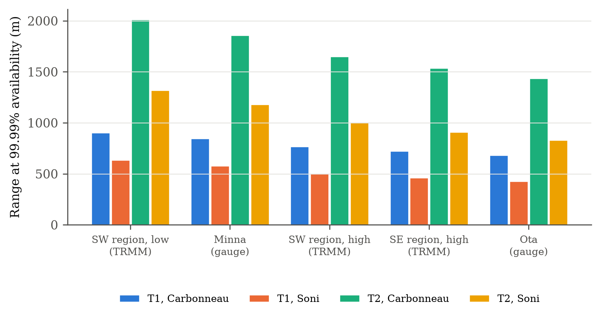
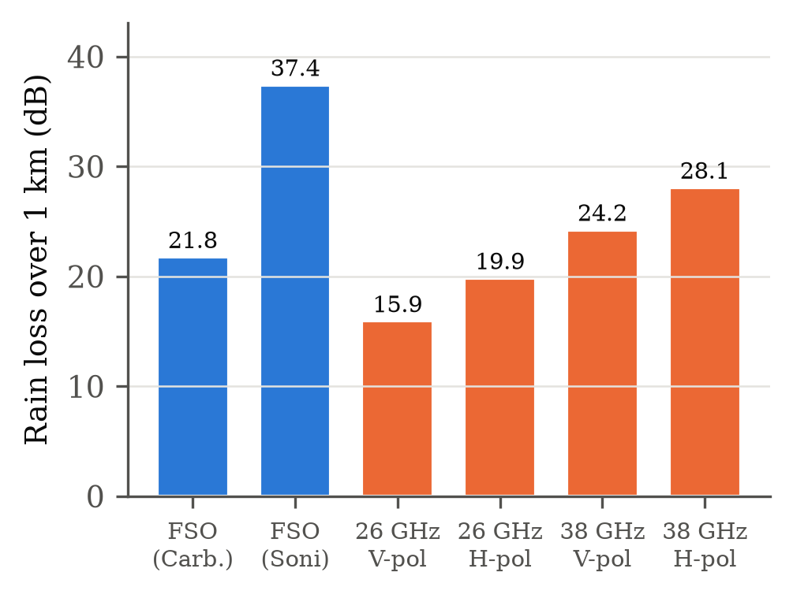

::: abstract
**Abstract.** Free-space optical (FSO) communication has moved from niche last-mile bridges toward a candidate backhaul, fronthaul and non-terrestrial link for 6G. Since 2022, field trials have carried more than 4 Tbit/s over 1.8 km and close to 1 Tbit/s net over 53 km, and adaptive optics, integrated photonic receivers and machine learning have entered the toolkit. Almost all of this progress has been made in temperate climates. This paper reviews the advances of 2022 to 2026 in channel modelling, turbulence mitigation, hybrid FSO/RF and FSO/THz systems, machine-learning prediction, ground-station diversity and low-cost testbeds, and then tests their implications for a tropical country. For Nigeria, measured and satellite-derived one-minute rain rates exceeded for 0.01% of the year range from 77 to 141 mm/h. At these rates, a tropical rain law fitted in 2023 predicts 1.7 to 1.9 times the attenuation of the widely used temperate law. For a representative terminal this shortens the range for 99.99% availability against rain from 680 to 900 m to 430 to 630 m. A high-end terminal with an amplified 1550 nm source and tracking reaches 0.83 to 2.0 km. A comparison with measured-rate predictions for Minna shows that 26 and 38 GHz millimetre-wave links lose 16 to 28 dB over 1 km in the same storms, comparable to the FSO loss, so the hybrid FSO/mmWave pairing that works in fog-dominated climates offers little protection against tropical rain. Harmattan dust haze adds a seasonal limit in the north, and chamber data suggest that visibility-based fog models underestimate it. The paper closes with a research agenda for tropical FSO.
:::

::: keywords
**Index Terms.** Free-space optics, 6G backhaul, tropical rain attenuation, Harmattan dust, hybrid FSO/RF, adaptive optics, machine learning, link availability, Nigeria.
:::

# I. Introduction

Free-space optical (FSO) links carry data on a narrow infrared beam between line-of-sight terminals. The technology offers licence-free spectrum, fibre-like capacity and quick installation, and it has long served as a bridge between buildings and a back-up for fibre [@khalighi; @kaushal]. Its weakness is equally well known. Fog, rain, dust and turbulence attenuate or distort the beam, and a link that carries tens of gigabits per second in clear air can fail in a fog bank [@ghassemlooy; @nadeem].

The years since 2022 have changed the scale of what FSO can do. Coherent transceivers, wavelength-division multiplexing and adaptive power control carried more than 4 Tbit/s over a 1.8 km urban link [@fernandes]. A full adaptive-optics system supported single-carrier Tbit/s line rates over a 53 km mountain path that mimics a satellite feeder link [@horst]. A 100 Gbit/s coherent link was held while tracking a drone at angular rates equivalent to a low-Earth-orbit pass [@walsh]. In parallel, surveys have positioned FSO as a backhaul and fronthaul technology for 6G terrestrial and non-terrestrial networks [@jeon; @elamassie; @alimi; @fayad], and a large body of work has studied hybrid FSO/RF and FSO/THz systems [@mohsan; @phuchortham; @singya].

Nearly all of these demonstrations took place in temperate climates, where fog is the dominant weather hazard. Tropical regions face a different mix. Rain rates exceeded for 0.01% of the year often exceed 100 mm/h, and seasonal dust haze reduces visibility over large areas. In West Africa the Harmattan carries Saharan dust south every dry season [@anuforom]. Nigeria is a useful test case. It spans coastal, rainforest, savanna and Sahel climates, it has published rain-rate and visibility statistics [@omotosho2009; @omotosho2013; @ojo2008; @ojo2022; @ojo2024], and its demand for backhaul outpaces the reach of fibre.

This paper makes four contributions.

1. A structured review of FSO advances published from 2022 to 2026, organised by channel modelling, turbulence mitigation, hybrid systems, machine learning, non-terrestrial links and low-cost testbeds, with an emphasis on results that bear on weather resilience.
2. A compilation of the atmospheric data sources available for FSO design in Nigeria, covering rain rate, visibility, fog and dust.
3. A quantitative case study showing that the choice between a temperate and a tropical rain law changes the range achievable at 99.99% availability by about one third, and that 26 to 38 GHz millimetre-wave back-ups suffer rain losses comparable to FSO in Nigerian storms.
4. A research agenda for tropical FSO, based on the gaps identified in the review and the case study.

Section II describes how the literature was selected. Sections III to V review channel modelling, mitigation and system advances, and low-cost testbeds. Section VI presents the Nigerian case study. Section VII sets out open problems, and Section VIII concludes.

# II. Scope and Method of the Review

The review covers peer-reviewed journal articles, magazine articles and conference papers published from January 2022 to September 2026. Candidate papers were identified through keyword searches of three scholarly indexes (Consensus, which draws on Semantic Scholar, PubMed, Scopus and arXiv, the Scite index, and publisher databases) on six themes: FSO surveys for 5G and 6G, weather attenuation measurements and models, machine-learning prediction, hybrid FSO/RF and FSO/THz links, turbulence mitigation and field trials, and ground-station availability. Bibliographic details were checked against publisher records. Foundational models published before 2022 are cited where the newer work builds on them. Papers were included when they reported measurements, closed-form analysis or system demonstrations relevant to weather resilience. Simulation-only studies that repeat standard models without new data were cited sparingly.

# III. Channel Modelling Advances

## A. Fog and Haze in Tropical and Sub-Saharan Settings

The visibility-based models of Kruse [@kruse], Kim [@kim] and their successors remain the design tools of choice, and recent tropical studies still apply them. Their inputs, however, now come from new data sources. Ojo et al. used five years of ECMWF reanalysis visibility for seven Nigerian cities and found that fog-induced attenuation at 1550 nm reaches about 0.25 dB/km at 99.99% availability in Lagos (Ikeja), rising to about 0.6 dB/km in Sokoto because of dust [@ojo2022]. A companion study linked visibility, humidity and temperature and found Sahel savanna locations most exposed, with up to about 0.68 dB/km, followed by coastal locations with about 0.66 dB/km [@ojo2024]. Bukar used two years of Nigerian Meteorological Agency (NiMet) visibility and rain data for Zaria and a commercial terminal specification, and concluded that a 1550 nm link could operate up to 6 km there, with haze loss at 6 km of about 3.2 dB at 1550 nm compared with 5.9 dB at 850 nm [@bukar]. In East Africa, Tarimo et al. applied the Kim and Kruse models to Tanzanian sites, measured links under clear and fog conditions, and showed that multiple-input multiple-output (MIMO) transmission improves performance in fog [@tarimo].

Two observations follow. First, the attenuation values derived from reanalysis visibility are low, because reanalysis grids smooth out the short, local visibility minima that cause outages. Station data at one-minute or ten-minute resolution are needed before these values can be used for 99.99% design. Second, the wavelength advantage of 1550 nm holds in haze, as the Zaria study confirms, but controlled-chamber results show that it disappears in dense fog [@ijaz], which is consistent with the Kim model.

## B. Rain

Rain attenuation at optical wavelengths has been predicted for decades with the power law of Carbonneau and Wisely, $\gamma_R = 1.076\,R^{0.67}$ dB/km, fitted to temperate data [@carbonneau], or with Marshall–Palmer drop size distributions [@marshall; @korai]. Recent tropical work challenges the first approach. Soni et al. built a 0.5 × 0.5 × 5 m rain chamber, extended the optical path to 15 m with mirrors, and measured a 1550 nm on-off keying link at rain rates up to 210 mm/h, typical of the Indian monsoon [@soni]. Their least-squares fit gave

$$\gamma_R = 0.63\,R^{0.91}\quad \mathrm{dB/km}, \qquad (1)$$

and they reported that measured attenuation departs significantly from the ITU-R prediction. The higher exponent means that the tropical law rises faster than the temperate one at high rain rates. The two laws cross at 9.3 mm/h. At 100 mm/h, (1) predicts 41.6 dB/km against 23.5 dB/km for the temperate law. Field work supports the statistical side of rain modelling. Gao et al. measured a 1 km urban link on rainy days and found that the received irradiance still follows a gamma-gamma distribution, while the bit error rate (BER) degraded from about $10^{-7}$ in light rain to about $10^{-2}$ in heavy rain [@gao]. Singh et al. used India Meteorological Department rain data for 2014 to 2017 and found mean rain attenuation from 1.91 dB/km in Hyderabad to 4.08 dB/km in Mumbai, which limited their coherent OFDM system to 5 km and 3.5 km respectively at a BER of $10^{-6}$ [@singh].

These studies share a limitation. Chamber rain may not reproduce the drop size distribution of convective tropical storms, and field data remain short. The difference between (1) and the temperate law is nevertheless large enough to matter for design, as Section VI shows.

## C. Dust

Dust is the neglected impairment of tropical FSO. Esmail et al. emulated dust storms in a chamber, derived an empirical attenuation model as a function of visibility, and found dust attenuation about seven times higher than fog attenuation at comparable conditions, while light and moderate dust still allowed links of hundreds of metres to a few kilometres [@esmail2016]. The same group later fitted probabilistic models to repeated chamber measurements and found that the Johnson SB distribution describes dust-induced attenuation with $R^2 \geq 0.95$ [@esmail2025]. For West Africa, Anuforom analysed 30 years of visibility data from 27 Nigerian synoptic stations and showed that thick Harmattan dust haze occurs on about 0.5 days per month near the Gulf of Guinea coast and about 6 days per month near the Sahel between November and February, with frequency rising exponentially with latitude [@anuforom]. No study found in this review measured FSO attenuation in Harmattan conditions directly.

## D. Turbulence

The log-normal and gamma-gamma models remain the standard statistical descriptions of scintillation [@andrews; @alhabash]. Recent work adds prediction. Islam et al. showed that machine learning applied to the raw received data stream classifies six laboratory turbulence levels with more than 98% accuracy, without auxiliary sensors [@islam]. Gao et al. confirmed in the field that the gamma-gamma model continues to hold when rain attenuation reduces the mean received power [@gao]. Tropical turbulence has received less attention. High surface temperatures and strong daytime convection suggest large values of $C_n^2$ near the ground, but no long-term $C_n^2$ statistics for West Africa were found in this review.

# IV. Mitigation and System Advances

## A. High-Capacity Field Trials

Table I summarises the main demonstrations. Their common thread is coherent detection combined with active compensation. Fernandes et al. used optical pre-amplification with automatic power control to reduce the perceived Rytov variance by a factor of ten and optimised the forward error correction (FEC) overhead per wavelength, reaching more than 4 Tbit/s over 1.8 km [@fernandes]. Brandão et al. added a low-cost LoRa radio feedback channel to pre-compensate the transmit power on the same 1.8 km path. Over 16 hours with about 10 dB of slow fading, the scheme reduced the receiver dynamic range by up to 5 dB and improved reliability by 7% on average [@brandao]. Jeon et al. validated long-range links of up to 20 km with an FPGA-based prototype and a channel emulator, using spatial filtering against sunlight and sampling-based pointing, acquisition and tracking [@jeon].

::: table
**TABLE I.** Representative FSO demonstrations reported since 2022

| Ref. | Path | Rate | Key technique | Weather relevance |
|---|---|---|---|---|
| [@fernandes] | 1.8 km urban | > 4 Tbit/s | Coherent WDM, automatic power control, FEC optimisation | Turbulence; no fog or rain statistics |
| [@brandao] | 1.8 km urban | 100 Gbit/s | Transmit power pre-compensation over LoRa feedback | 10 dB slow fading over 16 h |
| [@horst] | 53 km mountain | 0.94 Tbit/s net | Full adaptive optics, coherent formats | Strong turbulence, clear air |
| [@walsh] | Drone-mounted retroreflector | 100 Gbit/s | 10 Hz vision tracking, 200 Hz tip/tilt | LEO-rate tracking in turbulence |
| [@jeon] | Up to 20 km (emulated) | UHD video | FPGA prototype, spatial filtering, PAT | Turbulence and wind emulated |
| [@guan] | Kilometre-scale outdoor | 100 Gbit/s | Receiver-side optical pin beam | Turbulence |
| [@mcdonald] | 800 m | 10 Gbit/s, 16-QAM | Pilot-assisted self-coherent receiver | Moderate turbulence |
:::

## B. Turbulence Compensation

Adaptive optics has moved from astronomy into communications. Horst et al. showed that full adaptive optics does not distort coherent modulation formats and achieved 0.94 Tbit/s net over 53 km [@horst]. Walsh et al. nested 200 Hz tip/tilt correction inside 10 Hz machine-vision tracking to hold single-mode fibre coupling at 100 Gbit/s [@walsh]. Lower-complexity alternatives have appeared. Martinez et al. integrated a two-dimensional optical antenna array and a self-adjusting mesh of Mach–Zehnder interferometers on a silicon photonic chip that combines the distorted wavefront coherently at 10 Gbit/s [@martinez]. Guan et al. placed a static phase mask in front of the receiver lens to reshape the aberrated beam into a self-healing pin beam, which raised coupled-power stability by 26% and cut the BER by up to two orders of magnitude on a kilometre-scale link [@guan]. McDonald et al. co-propagated a continuous-wave pilot with the data beam and used a Kramers–Kronig receiver, which avoids a local oscillator and tolerates the loss of spatial coherence [@mcdonald]. These techniques address turbulence, not attenuation. None of them recovers a link lost to dense fog or heavy rain.

## C. Hybrid FSO/RF and FSO/THz Systems

Hybrid systems remain the main answer to weather outages. Mohsan et al. reviewed switching techniques, routing, channel models and modulation for hybrid FSO/RF networks [@mohsan], and Phuchortham and Sabit surveyed FSO with RF back-up, including machine-learning control [@phuchortham]. Aboelala et al. compared hybrid designs for 5G backhaul [@aboelala]. Singya et al. analysed a hybrid FSO/THz backhaul and showed that soft switching limits back-and-forth transitions while retaining most of the reliability gain [@singya]. Nguyen et al. used a UAV carrying a reconfigurable intelligent surface to route an FSO link from a high-altitude platform around cloud blockage, combined with weather-dependent switching and rate adaptation [@nguyen]. Shao et al. trained a random-forest model on local weather records to set the switching threshold and modulation order of a soft-switching FSO/RF link, focusing on rain and fog [@shao].

The classic argument for hybrid links rests on complementary weather sensitivity. Fog attenuates optical beams strongly but millimetre waves weakly, while rain attenuates millimetre waves strongly and optical beams moderately, so a 40 GHz back-up raises availability in fog-dominated climates [@nadeem]. Section VI-D tests whether this argument survives tropical rain.

## D. Machine Learning

Machine learning appears in three roles. The first is performance prediction. Kaur et al. predicted the SNR and BER of a radio-over-FSO system under rain, haze and clear weather, with an artificial neural network reaching $R^2$ of about 0.97 [@kaur]. The second is channel-state classification, as in the turbulence classifier of Islam et al. [@islam]. The third is control, as in the switching and modulation scheme of Shao et al. [@shao]. Most studies train on simulated data, often from commercial link simulators, and report very high accuracy on data drawn from the same simulator. The value of these models for real outages depends on training with measured, site-specific weather and link data, which remain scarce in the tropics.

## E. Non-Terrestrial Links and Ground-Station Diversity

FSO is now central to non-terrestrial network design. Elamassie and Uysal reviewed airborne FSO backhaul for UAVs and high-altitude platforms, covering geometric loss, attenuation, turbulence, pointing error and self-sustainability [@elamassie]. Wang et al. reviewed laser inter-satellite links and their pointing, acquisition and tracking systems [@wangisl]. For satellite-to-ground links, cloud cover dominates availability, and site diversity is the remedy. Birch et al. used satellite cloud data to show that eight Australasian ground stations with 69% average site availability could provide up to 99.97% reliability to a geostationary satellite [@birch], and Pham et al. proposed a placement method for Japanese ground stations based on cloud attenuation statistics [@pham]. Tropical regions combine frequent convective cloud with heavy rain, so the same diversity analysis applied to West Africa is an open task.

# V. Low-Cost Testbeds

Low-cost testbeds matter for teaching and for regions where commercial terminals are scarce. Gambo et al. built a laboratory testbed in Nigeria that transmits text and audio and compared a mini solar panel with a photodiode receiver under emulated fog and rain [@gambo]. The solar panel gave the higher SNR at the same BER, which the authors attributed to its larger field of view. The companion study to this paper built an LM386-based audio link with a solar-cell receiver and a gravity-fed rain emulator [@paper1]. It showed that the loss produced by such an emulator is governed by the water throughput rather than by drop size, that the emulator's equivalent specific attenuation exceeded natural extreme rain by two to three orders of magnitude, and that a wide field-of-view receiver recaptures forward-diffracted light and so understates extinction. Both studies point to the same lesson: low-cost receivers with large active areas behave differently from the narrow field-of-view receivers assumed by propagation models, and emulated weather must be characterised by its water or particle content before results can be compared with natural conditions.

# VI. Case Study: FSO Availability Against Rain and Dust in Nigeria

## A. Data

Table II lists the rain and visibility sources used. One-minute rain rates exceeded for 0.01% of an average year ($R_{0.01}$) were taken from satellite-derived estimates for 37 Nigerian stations, which give 77 to 110 mm/h in the South-West and 111 to 125 mm/h in the South-East [@omotosho2009], from rain-gauge measurements at Ota, which gave 141 mm/h [@omotosho2013], and from rain-gauge measurements at Minna, which gave 89 mm/h [@ibekwe]. The 0.01% level corresponds to about 53 minutes per year and is the usual design point for carrier-grade availability.

::: table
**TABLE II.** Atmospheric data sources for FSO design in Nigeria

| Quantity | Source | Coverage | Key value |
|---|---|---|---|
| One-minute rain rate | TRMM-derived, 37 stations [@omotosho2009] | 1998–2006 | $R_{0.01}$: 77–110 mm/h (South-West), 111–125 mm/h (South-East) |
| One-minute rain rate | Rain gauge, Ota [@omotosho2013] | 2012–2013 | $R_{0.01}$ = 141 mm/h |
| One-minute rain rate | Rain gauge, Minna [@ibekwe] | Two years | $R_{0.01}$ = 89 mm/h |
| Rain-rate maps | 30 years of Nigerian data [@ojo2008] | National | Contour maps |
| Visibility, fog attenuation | ECMWF reanalysis, 7 cities [@ojo2022; @ojo2024] | 2012–2016 | 0.25 dB/km (Ikeja) to 0.6 dB/km (Sokoto) at 99.99%, 1550 nm |
| Visibility and rain | NiMet station, Zaria [@bukar] | Two years | 1550 nm link feasible to 6 km |
| Harmattan dust haze | 27 synoptic stations [@anuforom] | 1971–2000 | 0.5 (coast) to 6 (Sahel) thick-haze days per month, Nov–Feb |
:::

## B. Method and Terminals

The link budget follows the standard form

$$M(L) = P_T - L_{opt} - 20\log_{10}\frac{D_T + \theta L}{D_R} - \gamma L - S_R, \qquad (2)$$

where $P_T$ is the transmit power in dBm, $L_{opt}$ the terminal optical loss, $D_T$ and $D_R$ the transmit and receive aperture diameters, $\theta$ the full beam divergence, $\gamma$ the specific attenuation of the weather at the design percentage, $L$ the link length and $S_R$ the receiver sensitivity [@ghassemlooy]. The geometric term is zero when the spot is smaller than the receiver. The range at a given availability is the distance at which $M(L) = 0$ with $\gamma$ evaluated at the rain rate exceeded for the corresponding percentage of time. Two terminals were considered (Table III). Terminal T1 is the representative terminal of the companion paper [@paper1]. Terminal T2 is an illustrative high-end terminal with an amplified 1550 nm source, a narrow beam held by tracking and a more sensitive receiver. Both sets of parameters are assumptions chosen to bracket current practice. The calculation script is provided as supplementary material.

::: table
**TABLE III.** Terminal parameters (assumed)

| Parameter | T1 (representative) | T2 (high-end) |
|---|---|---|
| Transmit power $P_T$ | 13 dBm | 23 dBm |
| Full divergence $\theta$ | 2 mrad | 0.5 mrad (tracking) |
| Apertures $D_T$ / $D_R$ | 2.5 cm / 8 cm | 2.5 cm / 10 cm |
| Terminal optical loss | 3 dB | 3 dB |
| Receiver sensitivity $S_R$ | −35 dBm | −40 dBm |
| Geometric loss at 1 km | 28.1 dB | 14.4 dB |
| Clear-air range (V = 20 km, 1550 nm) | 6.1 km | > 20 km |
:::

## C. Rain Results

Fig. 1 compares the temperate law, the tropical law (1) and the Marshall–Palmer geometric-optics bounds. Across the Nigerian band of $R_{0.01}$, the tropical law predicts 32.8 to 56.9 dB/km, which is 1.66 to 1.92 times the 19.8 to 29.6 dB/km of the temperate law. The Marshall–Palmer bounds, 12.2 to 35.8 dB/km, bracket the temperate law but fall below the tropical law at high rates. This pattern suggests that tropical convective rain, with its larger drops and higher drop concentrations, is poorly described by distributions and fits derived from temperate rain.

Fig. 2 and Table IV give the range at 99.99% availability against rain. For terminal T1, the temperate law gives 680 to 900 m and the tropical law 430 to 630 m. For terminal T2, the ranges are 1.44 to 2.01 km and 0.83 to 1.32 km. The choice of rain law therefore changes the design range by 30 to 42%, a larger effect than the difference between most of the Nigerian sites. The 10 dB of extra transmit power, the narrower beam and the 5 dB better sensitivity of T2 roughly double the range, but even T2 cannot deliver 99.99% availability beyond about 1.3 km at the wettest sites if the tropical law holds.

::: table
**TABLE IV.** Rain specific attenuation and range at 99.99% availability

| Site ($R_{0.01}$) | Temperate law (dB/km) | Tropical law (dB/km) | T1, temperate (m) | T1, tropical (m) | T2, temperate (m) | T2, tropical (m) |
|---|---|---|---|---|---|---|
| South-West, low (77 mm/h) | 19.8 | 32.8 | 902 | 635 | 2,011 | 1,319 |
| Minna (89 mm/h) | 21.8 | 37.4 | 844 | 578 | 1,856 | 1,181 |
| South-West, high (110 mm/h) | 25.1 | 45.4 | 766 | 502 | 1,650 | 1,004 |
| South-East, high (125 mm/h) | 27.3 | 51.0 | 722 | 461 | 1,537 | 910 |
| Ota (141 mm/h) | 29.6 | 56.9 | 682 | 426 | 1,437 | 829 |
:::

## D. Does a Millimetre-Wave Back-Up Help?

Ibekwe et al. predicted, with ITU-R P.530-17 and the measured Minna rain rate of 89 mm/h, rain attenuation over 1 km of 15.9 dB (vertical polarisation) and 19.9 dB (horizontal) at 26 GHz, and 24.3 dB and 28.1 dB at 38 GHz [@ibekwe]. Fig. 3 places these values beside the FSO loss for the same rain rate: 21.8 dB with the temperate law and 37.4 dB with the tropical law. The FSO values contain no path-reduction factor, so they are conservative, while the millimetre-wave values include one. Even so, the two technologies lose the same order of magnitude to the same storm. At the 0.01% point in Minna, a 26 GHz back-up saves only a few decibels relative to FSO under the temperate law, and 38 GHz saves nothing unless the tropical law applies.

This result qualifies the hybrid argument of Section IV-C. In fog-dominated climates, FSO and millimetre-wave links fail under different weather, so their outages rarely coincide [@nadeem]. In tropical climates where heavy rain dominates the 0.01% statistics, their outages coincide. A back-up that protects against rain must operate below about 10 GHz, where rain attenuation is small, which limits the back-up capacity to a fraction of the FSO rate. Alternatively, FSO/THz designs [@singya] need their own tropical rain assessment before they can be assumed to help.

## E. Harmattan Dust Haze

Table V bounds the effect of dust haze. The Kim model, applied as if the dust were haze, gives 10.1 dB/km at 1550 nm for a visibility of 1 km. Terminal T1 then reaches 1.39 km and terminal T2 3.47 km. If dust attenuation at the same visibility is seven times higher, as the chamber comparison of Esmail et al. suggests [@esmail2016], the specific attenuation rises to 71 dB/km and the ranges fall to 360 m and 690 m. The true value for Harmattan dust, whose particles are finer than those of desert storms by the time they reach southern Nigeria [@anuforom], probably lies between these bounds. Thick dust haze is rare on the coast but occurs on several days per month in the north during the dry season [@anuforom], and it coincides with the season in which rain is absent. Northern links are therefore dust-limited in the dry season, and southern links are rain-limited in the wet season.

::: table
**TABLE V.** Dust haze bounding cases at 1550 nm (Kim model as haze, and seven times Kim as a dust upper bound)

| Visibility (km) | Kim (dB/km) | 7 × Kim (dB/km) | T1, Kim (m) | T1, 7 × Kim (m) | T2, Kim (m) | T2, 7 × Kim (m) |
|---|---|---|---|---|---|---|
| 0.5 | 34.0 | 237.7 | 619 | 140 | 1,282 | 239 |
| 1.0 | 10.1 | 70.8 | 1,393 | 361 | 3,469 | 687 |
| 2.0 | 4.3 | 30.0 | 2,288 | 676 | 6,830 | 1,422 |
:::

## F. Design Guidance for Nigerian Links

The case study supports five practical rules. First, size terrestrial FSO links in southern Nigeria to about 0.5 to 0.9 km with a representative terminal, or 0.8 to 2 km with a high-end terminal, when 99.99% availability is required without a back-up. Second, use a tropical rain law, or better a local measurement, rather than the temperate power law, because the difference exceeds the difference between sites. Third, select a back-up below about 10 GHz for rain protection, and do not rely on 26 to 38 GHz millimetre waves. Fourth, in the north, plan for seasonal dust outages in the dry season and treat visibility-based fog models as a lower bound on dust attenuation. Fifth, relax the target to 99.9% for non-critical links. The rain rate exceeded for 0.1% of the year is far lower than $R_{0.01}$ in tropical climates, so the range at 99.9% is much longer.

# VII. Open Problems and Research Agenda

The review and the case study point to six gaps.

1. **Tropical rain laws from field links.** The only tropical optical rain law found here comes from a chamber [@soni]. A multi-year field link with a co-located one-minute rain gauge and a disdrometer in West Africa would settle whether (1) or the temperate law applies.
2. **Harmattan dust measurements.** No direct FSO measurement in Harmattan conditions was found. A link across a northern Nigerian campus during two dry seasons, with a transmissometer or visibility sensor, would fill this gap.
3. **Local turbulence statistics.** Long-term $C_n^2$ records for tropical sites are missing, although the field trials of Section IV-A show that turbulence mitigation is now mature enough to be designed against measured statistics.
4. **Machine learning trained on measured tropical data.** Most machine-learning studies train and test on simulated data. Weather-aware switching [@shao] and turbulence classification [@islam] need training sets from real tropical links.
5. **Sub-10 GHz hybrid design.** The case study shows that rain protection in the tropics requires a low-frequency back-up. Optimising the capacity split, switching and rate adaptation for such a pairing is an open design problem.
6. **Ground-station diversity for West Africa.** Cloud-diversity analyses of the kind done for Australasia [@birch] and Japan [@pham] have not been applied to West African ground stations, which will matter as optical satellite feeder links [@horst] mature.

# VIII. Conclusion

FSO has advanced rapidly since 2022. Coherent transceivers, adaptive optics, integrated photonic receivers and machine learning now allow terabit-class capacity over kilometre-scale paths and robust tracking of moving platforms. These advances address turbulence and pointing. They do not remove the attenuation of fog, rain and dust, and they have been demonstrated almost entirely in temperate climates. A case study for Nigeria showed that tropical rain dominates the design at 99.99% availability in the south, limiting a representative terminal to about 0.4 to 0.9 km and a high-end terminal to about 0.8 to 2 km, depending on which rain law is used. Millimetre-wave back-ups at 26 to 38 GHz suffer rain losses of the same order as FSO in the same storms, so hybrid designs for the tropics need a sub-10 GHz back-up. Harmattan dust adds a seasonal limit in the north that current fog models likely underestimate. Field measurements of tropical rain and dust attenuation, and machine-learning models trained on them, are the most valuable next steps for bringing high-capacity FSO to tropical networks.

# Data Availability

The case-study calculations are produced by the Python scripts `fso_models.py` and `paper2_case_study.py`, provided as supplementary material.

# References
